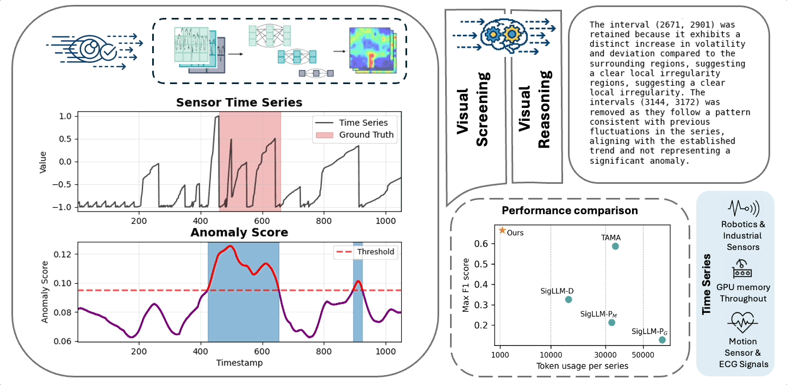

# [AAAI 2026 Oral] Harnessing Vision-Language Models for Time Series Anomaly Detection

<div align="center">
  
[Paper](https://arxiv.org/abs/2506.06836) | [Quick Start](#quick-start) | [Reproduce Results](#reproduce-paper-results) | [Citation](#citation)

</div>

<div align="center">
  
</div>

## Overview

VLM4TS is a two-stage, zero-shot anomaly detection pipeline for time series:
1. **ViT4TS (screening):** converts a time series into short sliding-window plots and scores anomalies via pre-trained vision encoders.
2. **VLM4TS (verification):** prompts a vision-language model with the long time horizons and ViT4TS proposals to refine anomalies.

## Quick Start

### Environment Setup

```bash
python -m venv .venv
source .venv/bin/activate
pip install -r requirements.txt
```

### Set Your OpenAI API Key (for VLM4TS)

```bash
export OPENAI_API_KEY="your_api_key_here"
```

VLM4TS uses the OpenAI client and reads `OPENAI_API_KEY` from the environment (see `src/models/vlm4ts.py`).

### Run on Your Own Time Series

Input format (Orion-compatible):
- A CSV or `pandas.DataFrame` with two columns: `timestamp` and `value`.
- `timestamp` can be numeric or datetime; rows are sorted by `timestamp` internally.

Output format:
- A `pandas.DataFrame` with columns `start`, `end`, `severity`, where `start` and `end` are anomaly interval timestamps.

```python
import pandas as pd
from src.models.vit4ts import ViT4TS
from src.models.vlm4ts import VLM4TS

df = pd.read_csv("your_series.csv")  # columns: timestamp, value
df = df[["timestamp", "value"]]

# Stage 1: ViT4TS screening
vit4ts = ViT4TS()
vit_intervals = vit4ts.detect(df)
print(vit_intervals.head())  # columns: start, end, severity

# Stage 2: VLM4TS verification (requires OPENAI_API_KEY)
vlm4ts = VLM4TS()
vlm_intervals = vlm4ts.detect(df)
print(vlm_intervals.head())
```

Notes:
- `ViT4TS.predict_scores(df)` returns `(aligned_scores, timestamps)` if you want raw anomaly scores.
- By default, `ViT4TS` uses `alpha=0.01` and `window_size=224`, with `alpha` being the uppper quantile for thresholding and `window_size` being the rolling window size for vision screening. One should tune these hyperparameters for the best performance.

### Reproduce Paper Results

```bash
bash run_experiments.sh
```

This script downloads benchmark datasets, runs VLM4TS across multiple alphas, and aggregates results.

## Repository Structure

```
├── data
│   └── raw                # Raw benchmark data
├── results                # Generated detection results and metrics
├── src
│   ├── evaluation         # Scoring, visualization, and utilities
│   ├── models             # ViT4TS and VLM4TS code
│   └── preprocessing      # Data conversion and image rendering
├── run_experiments.sh     # Full benchmark sweep
└── README.md              # You are here
```

## Citation

If this work is beneficial, please kindly cite:

```bibtex
@article{he2025harnessing,
  title={Harnessing Vision-Language Models for Time Series Anomaly Detection},
  author={He, Zelin and Alnegheimish, Sarah and Reimherr, Matthew},
  journal={arXiv preprint arXiv:2506.06836},
  year={2025}
}
```

If you find this work useful, please also consider starring the repo.

## Updates

Follow-up updates are coming soon.

## License

This project is released under the MIT License.
